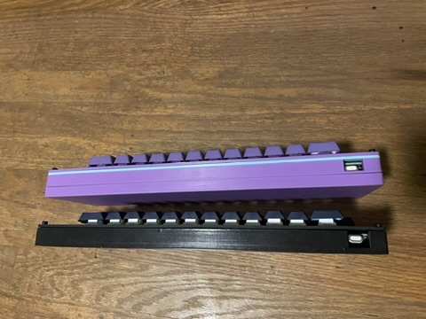
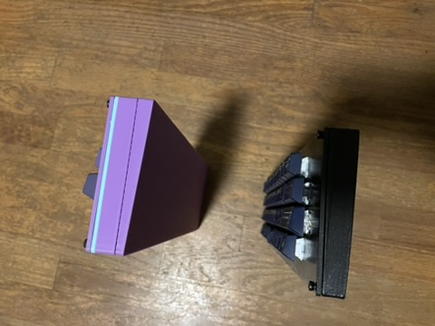

# Case
The case comes in two variants:

- Chonky, the original case I designed.
- AIO, a nicer slimmer case.

You will need:

- A 3D printer with a 300mm build volume, or be willing to print it side ways on
a smaller printer with plenty of supports.
- 4 M3 heated inserts (M3*4.6x5.7mm).
- 4 M3 screws.

I think AIO is better, but Chonky can be nice for it's added color options,
or if you want a nice flat surface on the edges from the 3D print.

To build:

- Print the plate stl.
- Print the base pieces of your chosen design.
- Add heat inserts.
- Use switches to affix PCB to plate.
- Insert M3 screws through plate into heat inserts.
- Enjoy!.

## Chonky VS Aio Cases

## Notes

- I have printed the case in PLA and PETG without issue.
- If you choose to use stabilizers, depending on the brand they might fit
too tightly in the provided cutouts. Some trimming may be required.
