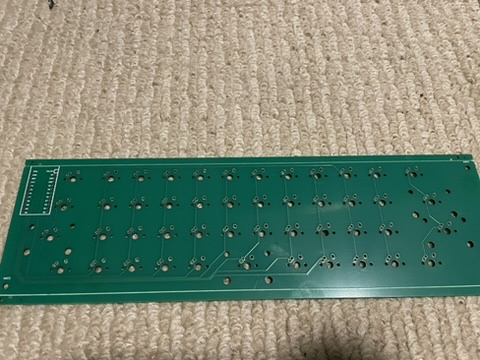
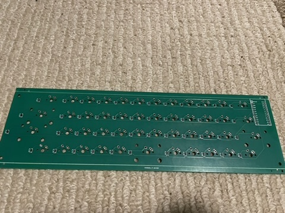

# PCB

- The basekitmicro folder contains the kicad project.
- The jlcpcb folder contains the files I used to get a run made by jlcpcb.

To build the pcb you will need:

- 47 SMD dioides if not using a soldering service. See BOM in jlcpcb folder.
- a pro micro.

