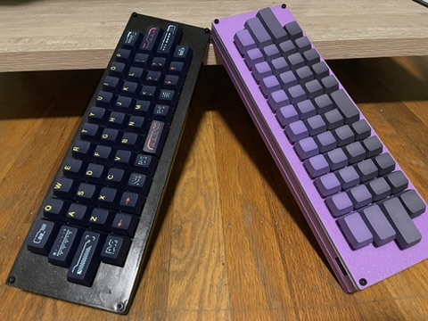

# Basekit-Micro

Basekit-micro is a 40% keyboard that uses a pro micro and a standard 60% base
kit for it's keys. Want to use a cool keyset and a planck layout? basekit is
here for you!

## Fair Warning

This is my first PCB design. I have built 3 PCBs of this and used them for a
year without issue, that doesn't mean it's perfect. I don't recommend using
it unless you have experience making PCBs from open source repos.

## Making it

- Visit the PCB folder to get the PCB produced.
- Visit the firmware folder to make your layout, or use mine.
- Visit the case folder and choose a case configuration.
- Enjoy.
